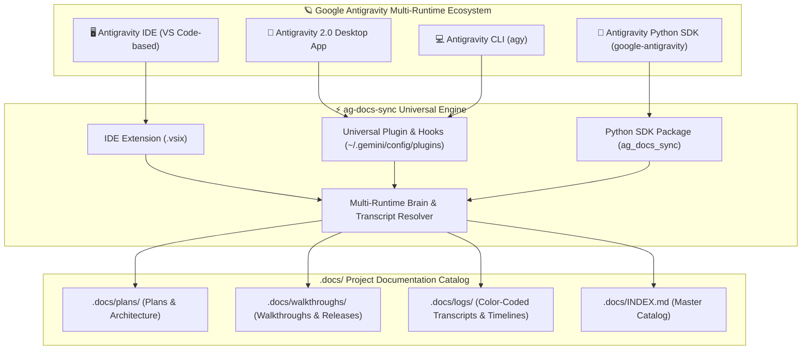

# 🚀 Universal Antigravity Docs & Session Log Archival Extension

> **Created by Don Sony and [infuse.ae](https://infuse.ae).**

A universal documentation and session transcript archival engine for Google Antigravity. Automatically captures, categorizes, timestamps, and indexes all project plans, walkthroughs, brain artifacts, and color-coded session logs into a clean `.docs/` directory across **all your projects**.

---

## 🌐 Full Support Across All Antigravity Runtimes & Versions

`ag-docs-sync` is built to seamlessly support all versions and types of Google Antigravity:

| Runtime / Edition | Interface / Type | How `ag-docs-sync` Integrates |
| :--- | :--- | :--- |
| **Antigravity IDE** | Standalone AI-First IDE (VS Code based) | GUI `.vsix` extension, sidebar tree view, status bar widget, command palette, and auto-sync. |
| **Antigravity 2.0** | Standalone Desktop Application | Universal agent plugin (`~/.gemini/config/plugins/ag-docs-sync`), desktop lifecycle hooks (`Stop`), canvas auto-archival. |
| **Antigravity CLI (`agy`)** | Terminal CLI & TUI Interface | Automatic brain & transcript discovery across runs, CLI flags, terminal status reporting. |
| **Antigravity Python SDK** | `google-antigravity` Library | `ag_docs_sync` Python package, `AntigravityDocsHook` lifecycle hook, context manager `sync_on_exit()`. |



---

## 🐍 Python SDK Integration (`google-antigravity`)

When using the official Antigravity Python SDK (`pip install google-antigravity`), integrate `ag-docs-sync` with just 2 lines of code:

### 1. Using the Context Manager (Recommended)
```python
import asyncio
from google.antigravity import Agent, LocalAgentConfig, CapabilitiesConfig
from ag_docs_sync import sync_on_exit

async def main():
    config = LocalAgentConfig(
        system_instructions="You are an expert full-stack developer.",
        capabilities=CapabilitiesConfig()
    )

    # Automatically archives plans, artifacts, and transcripts to .docs/ upon exit
    with sync_on_exit(workspace_path="."):
        async with Agent(config) as agent:
            response = await agent.chat("Build an authenticated REST API")
            async for token in response:
                print(token, end="", flush=True)

if __name__ == "__main__":
    asyncio.run(main())
```

### 2. Using the Hook Adapter Object
```python
from ag_docs_sync import AntigravityDocsHook

hook = AntigravityDocsHook(workspace_path="./my-project")

# ... run agent workflow ...

# Explicitly trigger archival for a specific conversation session
hook.sync(conversation_id="session-uuid")
```

---

## 🖥️ Antigravity IDE GUI Extension

- **Visible in `Extensions >> Installed`** in Antigravity IDE / VS Code.
- **Status Bar Widget**: Displays real-time sync status (`$(book) Docs: Active`) with one-click manual sync.
- **Sidebar Tree View**: Browse indexed `.docs/` categories (Plans, Walkthroughs, Research, Diagrams, Media, Session Logs) in the Activity Bar.
- **Command Palette Commands**:
  - `Antigravity Docs: Sync Now` — Immediately sync project artifacts.
  - `Antigravity Docs: Open .docs Directory` — Jump straight to documentation.
  - `Antigravity Docs: Open Session Logs` — Browse archived conversation transcripts.
  - `Antigravity Docs: Toggle Auto-Sync On/Off` — Toggle global master switch.
  - `Antigravity Docs: Exclude Current Workspace` — Opt out current workspace.
  - `Antigravity Docs: Re-enable Current Workspace` — Re-enable current workspace.
  - `Antigravity Docs: Show Status & Diagnostic Info` — Print diagnostic health check across runtimes.

---

## 📦 Universal Installation & CLI

### 1. One-Step Universal Setup (All Antigravity Editions)
```bash
python install.py --all
```
This configures the global AI plugin for Antigravity 2.0 / CLI, builds & installs the IDE extension, and installs the Python SDK package.

### 2. Multi-Runtime Status Check
```bash
python install.py status
```
*Outputs real-time detection of installed Antigravity runtimes:*
```text
=================================================================
 🚀 Antigravity Extension Status: ag-docs-sync
=================================================================
  • AI Agent Plugin (Global) : ✅ Installed
  • Global Plugin Location   : C:\Users\user\.gemini\config\plugins\ag-docs-sync
  • Master Auto-Sync Switch  : 🟢 Enabled
  • Excluded Projects Count  : 0
-----------------------------------------------------------------
 📡 Antigravity Multi-Runtime Ecosystem Detection:
  • Antigravity IDE           : ✅ Detected -> C:\Users\user\.gemini\antigravity-ide
  • Antigravity 2.0           : ✅ Detected -> C:\Users\user\.gemini\antigravity
  • Antigravity CLI (agy)     : ✅ Detected -> C:\Users\user\.gemini\antigravity-cli
  • Antigravity Python SDK    : ✅ Detected -> Installed in Python environment
  • Global Customizations Root: ✅ Detected -> C:\Users\user\.gemini\config
=================================================================
```

### 3. Individual Component Targets
```bash
# Antigravity IDE VSIX package & install
python install.py --ide

# Antigravity Python SDK package
python install.py --sdk

# Global Plugin only (Antigravity 2.0 & CLI)
python install.py install --global

# Local workspace plugin only
python install.py install --local "D:/Projects/MyApp"
```

---

## 🚫 Excluding Projects from Auto-Sync

### Via IDE Command Palette
1. Open the project in Antigravity IDE.
2. Press `Ctrl+Shift+P` → **`Antigravity Docs: Exclude Current Workspace from Auto-Sync`**.

### Via CLI
```bash
# Exclude a project path
python install.py exclude "D:/Projects/PrivateApp"

# Re-enable a project
python install.py unexclude "D:/Projects/PrivateApp"

# List all excluded projects
python install.py list-excluded
```

### Via Local Marker File (`.docs-ignore`)
Place an empty `.docs-ignore` file in the project root:
```bash
echo. > .docs-ignore
```

---

## 📂 Generated `.docs/` Directory Structure

```text
my-project/
├── .docs/
│   ├── INDEX.md                         # Master documentation index
│   ├── README.md                        # Mirror index for GitHub/viewers
│   ├── plans/
│   │   ├── implementation_plan.md       # Current active plan
│   │   └── implementation_plan_2026-08-16_174400.md
│   ├── walkthroughs/
│   │   ├── walkthrough.md               # Current active walkthrough
│   │   └── walkthrough_2026-08-16_174400.md
│   ├── research/
│   │   └── api_architecture_2026-08-16_174400.md
│   ├── diagrams/
│   │   └── system_flow_2026-08-16_174400.mermaid
│   ├── media/
│   │   └── dashboard_mockup_2026-08-16_174400.png
│   ├── scratch/
│   │   └── test_api_2026-08-16_174400.py
│   └── logs/
│       ├── LATEST_SESSION.md            # Most recent conversation log
│       ├── TIMELINE.md                  # Project historical timeline
│       └── session_2026-08-16_174400_7e598545.md
```

---

## 📝 Changelog

### v1.0.2 - Universal Multi-Version & Multi-Type Antigravity Support
- **Full Support for All Antigravity Editions**:
  - **Antigravity 2.0**: Native desktop app lifecycle integration & canvas archiving.
  - **Antigravity CLI (`agy`)**: Automatic transcript & multi-brain discovery across terminal sessions.
  - **Antigravity IDE**: AI-first IDE extension (`.vsix`), activity bar tree view, status bar widget, command palette.
  - **Antigravity Python SDK (`google-antigravity`)**: First-class `ag_docs_sync` package, `AntigravityDocsHook`, and `sync_on_exit()` context manager.
- **Universal Multi-Runtime Discovery**:
  - Automatic cross-discovery across `antigravity-ide`, `antigravity`, `antigravity-2.0`, `antigravity-app`, `antigravity-cli`, and `antigravity-sdk`.
  - Environment variable overrides: `ANTIGRAVITY_BRAIN_DIR`, `ANTIGRAVITY_DATA_DIR`, `AGY_DATA_DIR`, `GEMINI_HOME`.
- **Ecosystem Management & Diagnostics**:
  - `python install.py --all` for 1-click universal installation.
  - `python install.py status` for real-time multi-runtime diagnostic reporting.

---

## 🧪 Testing

Run the Python test suite:
```bash
python -m unittest discover tests
```

---

## 👤 Author & Organization
- **Created by**: Don Sony and [infuse.ae](https://infuse.ae)
- **Website**: [https://infuse.ae](https://infuse.ae)

---

## 📄 License
MIT License
