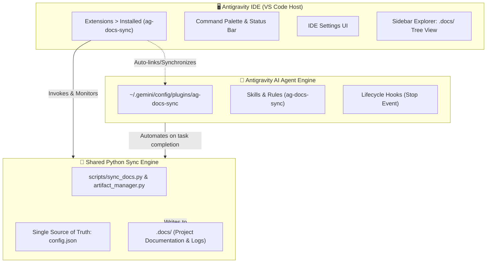

# 🚀 Antigravity Docs & Session Log Archival Extension

> **Created by Don Sony and [infuse.ae](https://infuse.ae).**

A **hybrid Antigravity IDE Extension & AI Agent Plugin** that automatically captures, categorizes, timestamps, and indexes all project documents, brain artifacts, and color-coded conversation session logs into a clean `.docs/` directory across **all your projects**.

---

## 🌟 Dual-Layer Architecture

`ag-docs-sync` works simultaneously at two levels with **zero conflicts**:



### 1. Antigravity IDE GUI Extension
- **Visible in `Extensions >> Installed`** in Antigravity IDE / VS Code.
- **Status Bar Widget**: Displays real-time sync status (`$(book) Docs: Active`) with one-click manual sync.
- **Sidebar Tree View**: Browse indexed `.docs/` categories (Plans, Walkthroughs, Decisions, Session Logs) directly from the IDE activity bar.
- **Command Palette Commands**:
  - `Antigravity Docs: Sync Now` — Immediately sync project artifacts.
  - `Antigravity Docs: Open .docs Directory` — Jump straight to documentation.
  - `Antigravity Docs: Open Session Logs` — Browse archived conversation transcripts.
  - `Antigravity Docs: Toggle Auto-Sync On/Off` — Toggle global master switch.
  - `Antigravity Docs: Exclude Current Workspace` — Opt out current workspace.
  - `Antigravity Docs: Re-enable Current Workspace` — Re-enable current workspace.
  - `Antigravity Docs: Show Status & Diagnostic Info` — Print diagnostic health check.

### 2. Antigravity AI Agent Plugin
- Installed in `~/.gemini/config/plugins/ag-docs-sync` (or `<workspace>/.agents/plugins/ag-docs-sync`).
- Uses Antigravity's `Stop` lifecycle hook (`hooks.json`) to trigger automatic background archival whenever the AI finishes a task.
- Provides `ag-docs-sync` skill (`SKILL.md`) for AI-assisted documentation management.

---

## 🔒 Zero Conflict Guarantee

The IDE extension and the AI agent plugin share:
- **A Single Source of Truth**: All configurations and project exclusions reside in `~/.gemini/config/plugins/ag-docs-sync/config.json`.
- **Idempotent File Syncing**: File hashing (MD5) and timestamp checks ensure that manual triggers from the IDE UI and automated AI agent hooks never collide or duplicate writes.
- **Synchronized Exclusions**: Excluding or re-enabling a project via the IDE Command Palette applies immediately to both the AI agent and the GUI.

---

## 📦 Installation & Setup

### Option 1: Install Both IDE Extension & Agent Plugin (Recommended)

1. **Build and package the `.vsix` extension:**
   ```bash
   python install.py --vsix
   ```
2. **Install in Antigravity IDE:**
   - In Antigravity IDE, press `Ctrl+Shift+P` (or `Cmd+Shift+P` on Mac).
   - Type **`Extensions: Install from VSIX...`** and select `ag-docs-sync-1.0.2.vsix`.
   - *The extension will activate, appear in `Extensions >> Installed`, and automatically verify the AI agent plugin.*

### Option 2: Install AI Agent Plugin Only (CLI / Background)

```bash
# Windows
.\install.bat

# PowerShell
.\install.ps1

# Cross-platform Python
python install.py
```

### Check Installation Status
```bash
python install.py status
```

---

## 🚫 Excluding Projects from Auto-Sync

### Via IDE Command Palette
1. Open the project in Antigravity IDE.
2. Press `Ctrl+Shift+P` → **`Antigravity Docs: Exclude Current Workspace from Auto-Sync`**.

### Via CLI
```bash
# Exclude a project path
python install.py exclude "D:/Projects/PrivateApp"

# Re-enable a project
python install.py unexclude "D:/Projects/PrivateApp"

# List all excluded projects
python install.py list-excluded
```

### Via Local Marker File (`.docs-ignore`)
Place an empty `.docs-ignore` file in the project's root folder:
```bash
echo. > .docs-ignore
```

---

## 📂 Generated `.docs/` Directory Structure

```text
my-project/
├── .docs/
│   ├── INDEX.md                         # Master documentation index
│   ├── README.md                        # Mirror index for GitHub/viewers
│   ├── plans/
│   │   ├── implementation_plan.md       # Current active plan
│   │   └── implementation_plan_2026-08-16_174400.md
│   ├── walkthroughs/
│   │   ├── walkthrough.md               # Current active walkthrough
│   │   └── walkthrough_2026-08-16_174400.md
│   ├── research/
│   │   └── api_architecture_2026-08-16_174400.md
│   ├── diagrams/
│   │   └── system_flow_2026-08-16_174400.mermaid
│   ├── media/
│   │   └── dashboard_mockup_2026-08-16_174400.png
│   ├── scratch/
│   │   └── test_api_2026-08-16_174400.py
│   └── logs/
│       ├── LATEST_SESSION.md            # Most recent conversation log
│       ├── TIMELINE.md                  # Project historical timeline
│       └── session_2026-08-16_174400_7e598545.md
```

---

## 📝 Changelog

### v1.0.2
- **Hybrid IDE & Agent Architecture**:
  - Added VS Code / Antigravity IDE GUI Extension manifest and runtime (`package.json`, `dist/extension.js`).
  - Added **Extensions → Installed** visibility.
  - Added **Status Bar Widget** (`$(book) Docs: Active`) with manual sync trigger.
  - Added **Sidebar Tree View** (`Project Documentation (.docs/)`) in the Activity Bar.
  - Added Command Palette commands (`Sync Now`, `Open .docs`, `Open Session Logs`, `Exclude/Include Workspace`, `Show Status`).
  - Added **Zero-Conflict Coexistence Engine**: Shared single source of truth configuration and MD5 hash idempotency.
  - Packaged installable `.vsix` bundle via `python install.py --vsix`.

### v1.0.1
- **Automated Lifecycle Hooks & Session Log Archival**:
  - Integrated Antigravity `Stop` event hook to automatically archive artifacts on task completion.
  - Color-coded markdown session logs with tool execution badges and thought block collapsing.
  - Categorized subfolder organization (`plans/`, `walkthroughs/`, `research/`, `diagrams/`, `media/`, `scratch/`, `logs/`).
  - Timestamped snapshot history and master catalog `INDEX.md`.

---

## 🧪 Testing

Run the Python test suite:
```bash
python -m unittest discover tests
```

---

## 👤 Author & Organization
- **Created by**: Don Sony and [infuse.ae](https://infuse.ae)
- **Website**: [https://infuse.ae](https://infuse.ae)

---

## 📄 License
MIT License

